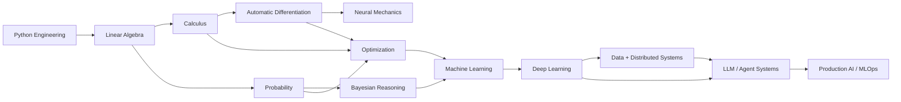

<div align="center">

# AI Engineer Journey

### From first principles → intelligent systems

**A public engineering lab for building AI understanding from the bottom of the stack upward.**

[](./python-for-ai)
[](./math-for-ai)
[](./ROADMAP.md)
[](./ROADMAP.md)
[](./ROADMAP.md)
[](https://github.com/usman611b/ai-engineer-journey/actions/workflows/python-sanity.yml)

**21 day folders · 2 active foundation tracks · 90+ math session/practice artifacts · growing in public**

[Roadmap](./ROADMAP.md) · [Python Track](./python-for-ai/README.md) · [Math Track](./math-for-ai/README.md) · [Current Lab](./math-for-ai/day-21) · [Portfolio](https://www.usmanalii.com/)

</div>

---

## The idea behind this repository

This repository is not a list of technologies I want to be associated with.

It is the **evidence trail of how I am building the stack underneath intelligent systems**.

Instead of jumping directly to high-level frameworks, I am working upward through the layers that make those frameworks understandable:

```text
programming
    ↓
mathematical representation
    ↓
calculus + gradients
    ↓
automatic differentiation
    ↓
probability + uncertainty
    ↓
Bayesian reasoning
    ↓
optimization
    ↓
machine learning
    ↓
deep learning
    ↓
data + distributed systems
    ↓
LLMs / agents / intelligent applications
    ↓
MLOps + production AI
```

The long-term engineering question is simple:

> **What has to be understood, implemented, tested, connected, and operated before an AI system becomes genuinely useful?**

That question is the organizing principle of the repository.

---

# Current state

| Track | Repository evidence | Status | What it is building toward |
|---|---|---:|---|
| **Python engineering** | [`python-for-ai/day-01`](./python-for-ai/day-01) → [`day-12`](./python-for-ai/day-12) | ✅ Foundation built | Reliable implementation, debugging, numerical work, model code |
| **Linear algebra** | [`math-for-ai/day-13`](./math-for-ai/day-13) → [`day-15`](./math-for-ai/day-15) | ✅ Covered | Vectors, representations, transformations, model geometry |
| **Calculus** | [`day-16`](./math-for-ai/day-16) → [`day-17`](./math-for-ai/day-17) | ✅ Covered | Gradients, curvature, chain rule, backpropagation |
| **Autodiff + neural mechanics** | [`day-18`](./math-for-ai/day-18) | ✅ Covered | Computational graphs, backward pass, MLP mechanics |
| **Probability** | [`day-19`](./math-for-ai/day-19) | ✅ Covered | Distributions, uncertainty, log probabilities, cross-entropy |
| **Bayesian reasoning** | [`day-20`](./math-for-ai/day-20) | ✅ Covered | Updating belief, MLE/MAP, uncertainty, Bayesian comparison |
| **Optimization** | [`day-21`](./math-for-ai/day-21) | 🚧 Current deep-dive | Training dynamics, optimizer behavior, loss landscapes |
| **Machine learning** | Roadmap phase | ⏳ Planned | Classical supervised/unsupervised learning + evaluation |
| **Deep learning** | Roadmap phase | ⏳ Planned | Modern neural networks, CV/NLP, training systems |
| **Big data + data systems** | Roadmap phase | ⏳ Planned | Scalable processing, distributed data pipelines, feature systems |
| **LLM / agents / MLOps** | Roadmap phase | ⏳ Planned | Production intelligent systems |

**Legend:** ✅ implemented/documented · 🚧 active · ⏳ planned

> Planned phases are intentionally shown as planned. The repository only claims a layer when there is real code, notes, experiments, or systems behind it.

---

# Current lab — optimization & learning dynamics

The active technical focus in the repository is not simply “using Adam.” It is understanding **why optimization behaves differently across landscapes and update rules**.

The current lab includes:

- gradient descent mechanics;
- learning-rate sensitivity;
- batch vs stochastic vs mini-batch updates;
- momentum and velocity accumulation;
- Adam first/second moments;
- Adam bias correction;
- Adam implemented from scratch;
- learning-rate schedules;
- convex vs non-convex objectives;
- saddle points and plateaus;
- loss landscapes;
- sharp vs flat minima;
- the Rosenbrock function as an optimizer stress test;
- vanilla GD vs momentum on Rosenbrock;
- GD vs Momentum vs Adam comparisons;
- small experiments designed to explain behavior rather than only return a final number.

→ Explore [`math-for-ai/day-21`](./math-for-ai/day-21)

---

# Repository architecture

```text
ai-engineer-journey/
│
├── README.md                    # Command center / current state
├── ROADMAP.md                   # Full AI engineering progression
├── .github/
│   └── workflows/
│       └── python-sanity.yml    # Automated Python quality gate
│
├── python-for-ai/
│   ├── README.md
│   └── day-01 ... day-12        # Programming + Python engineering foundation
│
└── math-for-ai/
    ├── README.md                # Detailed math curriculum + concept map
    ├── day-13                   # Vector spaces, matrices, similarity, basis
    ├── day-14                   # Matrix operations + neural-network bridge
    ├── day-15                   # Transformations + eigen intuition
    ├── day-16                   # Derivatives, chain rule, Hessian, optimizers
    ├── day-17                   # Second-order ideas, integrals, backpropagation
    ├── day-18                   # Autodiff, activations, MLP, XOR, gradient checks
    ├── day-19                   # Probability, distributions, softmax, cross-entropy
    ├── day-20                   # Bayes, MLE/MAP, Beta uncertainty, A/B testing
    └── day-21                   # Optimization deep-dive
```

The repository expands only when the next layer becomes real work. I do not create empty `deep-learning/`, `llm/`, or `agents/` folders simply to make the repository look larger.

---

# How a concept becomes evidence

The learning unit is not “I read a chapter.” A strong topic should leave an engineering artifact behind.

```text
QUESTION
   ↓
INTUITION
   ↓
MATHEMATICS
   ↓
NUMERICAL EXAMPLE
   ↓
FROM-SCRATCH CODE
   ↓
EXPERIMENT / COMPARISON
   ↓
INTERPRETATION
   ↓
CONNECTION TO THE LARGER AI SYSTEM
```

| Evidence type | What it demonstrates |
|---|---|
| **Plain-language explanation** | I can explain the mechanism instead of repeating notation |
| **Derivation / calculation** | I can trace where the result comes from |
| **From-scratch implementation** | I understand what the library abstraction is hiding |
| **Numerical example** | I can follow the mechanism concretely |
| **Experiment** | I can test a claim rather than only accept it |
| **Comparison** | I can reason about trade-offs and failure modes |
| **Visualization** | I can inspect behavior across a space or over time |
| **Reflection** | I can explain what changed in my understanding |

---

# Foundation dependency map



This is why the math track is not separate from engineering. Each layer removes a black box from the next one.

---

# What is already implemented in the math track

The detailed curriculum lives in [`math-for-ai/README.md`](./math-for-ai/README.md), but the progression currently looks like this:

| Day | Core theme | Representative concepts |
|---:|---|---|
| **13** | Linear Algebra I | vectors, matrices, dot product, cosine similarity, projection, basis, rank, Gram–Schmidt |
| **14** | Linear Algebra II | matrix operations, determinant, inverse, 2-layer neuron-network practice |
| **15** | Transformations | rotation, scaling, shearing, reflection, composition, determinant geometry, eigenvectors/eigenvalues |
| **16** | Calculus for learning | derivatives, numerical vs analytical gradients, partials, chain rule, Hessian, optimizer connection |
| **17** | Gradient bridge | second-order optimization, integrals, backpropagation |
| **18** | Autodiff + neural mechanics | computational graphs, backward pass, operations, activations, MLP, XOR, gradient checking, PyTorch comparison |
| **19** | Probability | distributions, expectation, variance, joint/marginal probability, CLT, log-probability, softmax, cross-entropy, sampling |
| **20** | Bayesian inference | Bayes, base rates, sequential updating, Naive Bayes, smoothing, MLE, MAP, Beta uncertainty, Bayesian A/B testing |
| **21** | Optimization | GD, SGD, mini-batch, momentum, Adam, schedules, landscapes, minima, Rosenbrock experiments |

→ [`Open the full Math for AI curriculum`](./math-for-ai/README.md)

---

# Engineering quality gate

The repository includes a GitHub Actions workflow that checks the Python learning code on multiple Python versions.

Current CI responsibilities:

- compile Python modules under the active learning tracks;
- run against Python 3.11 and 3.12;
- catch genuine unresolved Git merge markers;
- ignore local virtual-environment artifacts during merge-marker scanning.

→ [`.github/workflows/python-sanity.yml`](./.github/workflows/python-sanity.yml)

The goal is simple: **learning code should still be treated like code.**

---

# The full roadmap

The repository is designed around phase gates rather than buzzword collection.

| Phase | Layer | State | Exit evidence |
|---:|---|---:|---|
| **0** | Python engineering | ✅ | clean Python, reusable abstractions, numerical coding confidence |
| **1** | Math foundations | 🚧 | executable intuition across linear algebra, calculus, probability, Bayes, optimization |
| **2** | Data + scientific Python | ⏳ | data analysis pipeline + numerical experimentation |
| **3** | Classical ML | ⏳ | models from scratch + evaluation + end-to-end ML project |
| **4** | Deep Learning | ⏳ | training loops + modern architectures + experiments |
| **5** | CV / NLP | ⏳ | domain-specific deep-learning systems |
| **6** | Big Data + distributed data | ⏳ | scalable processing + distributed pipeline project |
| **7** | LLM systems | ⏳ | embeddings, retrieval, RAG, evaluation, tool use |
| **8** | Agents | ⏳ | stateful tool-using workflow with reliability controls |
| **9** | MLOps + AI infrastructure | ⏳ | packaging, deployment, monitoring, reproducibility, CI/CD |
| **10** | Production capstones | ⏳ | systems that integrate model + data + software + infrastructure |

The detailed build gates, questions, and deliverables for every phase are in [`ROADMAP.md`](./ROADMAP.md).

---

# Navigation

If you are opening the repository for the first time:

1. **Start here** — this README explains the architecture and current state.
2. Open [`ROADMAP.md`](./ROADMAP.md) for the complete progression.
3. Open [`python-for-ai/README.md`](./python-for-ai/README.md) for the programming foundation.
4. Open [`math-for-ai/README.md`](./math-for-ai/README.md) for the detailed mathematical curriculum.
5. Inspect [`math-for-ai/day-21`](./math-for-ai/day-21) for the current active lab.
6. Browse the commit history to see how the material evolved session by session.

---

# Principles

> **Understand before abstracting.**  
> **Implement before depending.**  
> **Experiment before concluding.**  
> **Debug instead of hiding failure.**  
> **Connect the model to the system around it.**  
> **Keep the evidence.**

The objective is not to move through AI labels as quickly as possible.

The objective is to become capable of moving across the entire path — **from mathematical mechanism to model behavior to engineered intelligent system** — without treating the layers in between as magic.

---

<div align="center">

### Engineering, evidenced.

[GitHub Profile](https://github.com/usman611b) · [Portfolio](https://www.usmanalii.com/) · [Full Roadmap](./ROADMAP.md)

</div>
