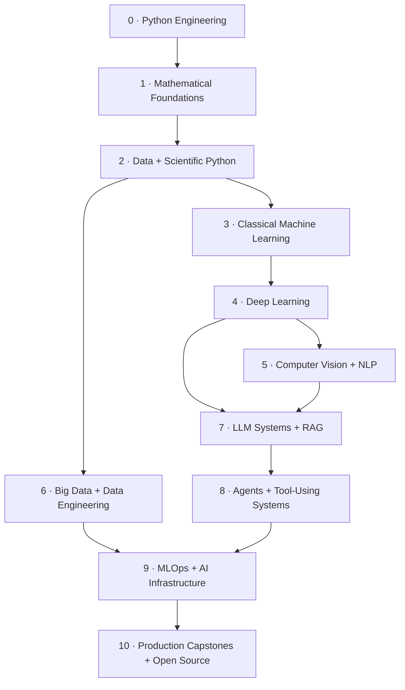

<div align="center">

# AI Engineering Roadmap

### Foundations → Models → Data → Intelligent Systems → Production

**The roadmap behind `ai-engineer-journey`**

[← Main README](./README.md) · [Python Track](./python-for-ai/README.md) · [Math Track](./math-for-ai/README.md)

</div>

---

# Roadmap contract

This roadmap is a **build order**, not a list of technologies to claim.

A phase is not considered complete because I watched a course or used a library once. Each phase has an **exit gate**: code, experiments, explanations, comparisons, or a working system that provides evidence of understanding.

### Status language

- ✅ **Evidence exists in the repository**
- 🚧 **Active learning / active build**
- ⏳ **Planned — not yet claimed as completed**

---

# System view



The order is not perfectly linear in real engineering. Later phases feed back into earlier ones. The roadmap gives each new abstraction enough foundation that it does not arrive as magic.

---

# Progress dashboard

| Phase | Layer | Status | Primary evidence |
|---:|---|:---:|---|
| **0** | Python Engineering | ✅ | [`python-for-ai/`](./python-for-ai) |
| **1** | Mathematical Foundations | 🚧 | [`math-for-ai/`](./math-for-ai) |
| **2** | Data + Scientific Python | ⏳ | planned |
| **3** | Classical Machine Learning | ⏳ | planned |
| **4** | Deep Learning | ⏳ | planned |
| **5** | Computer Vision + NLP | ⏳ | planned |
| **6** | Big Data + Data Engineering | ⏳ | planned |
| **7** | LLM Systems + RAG | ⏳ | planned |
| **8** | Agents + Tool-Using Systems | ⏳ | planned |
| **9** | MLOps + AI Infrastructure | ⏳ | planned |
| **10** | Production Capstones + Open Source | ⏳ | planned |

---

# Phase 0 — Python Engineering ✅

## Objective

Build enough programming strength that Python is not the bottleneck when the work becomes mathematical, data-heavy, model-heavy, or systems-heavy.

## Core areas

- language fundamentals and control flow;
- functions and scope;
- collections and iteration;
- modules and packages;
- exceptions and file handling;
- object-oriented programming;
- iterators and generators;
- functional patterns;
- environments, dependencies, and packaging habits;
- debugging and reusable code organization;
- advanced Python concepts added as needed by later phases.

## Exit gate

I should be able to:

- implement an algorithm from a mathematical description;
- organize non-trivial code into reusable functions/classes;
- debug failures without rewriting everything;
- use environments/dependencies deliberately;
- read unfamiliar Python code confidently;
- move between plain Python and numerical libraries without losing the underlying idea.

## Evidence

→ [`python-for-ai/`](./python-for-ai)

---

# Phase 1 — Mathematical Foundations 🚧

## Objective

Understand the mathematics that directly controls representation, uncertainty, learning, and optimization.

## Layer 1A — Linear algebra ✅

Questions:

- What does a vector represent?
- What does a dot product measure?
- Why does cosine similarity capture directional similarity?
- What does projection mean geometrically?
- What information do basis and rank expose?
- How does a matrix transform a space?
- What do determinants and eigenvectors tell us about a transformation?

Evidence:

→ [`math-for-ai/day-13`](./math-for-ai/day-13)  
→ [`math-for-ai/day-14`](./math-for-ai/day-14)  
→ [`math-for-ai/day-15`](./math-for-ai/day-15)

## Layer 1B — Calculus + backpropagation ✅

Questions:

- What is a derivative actually measuring?
- How do partial derivatives work in multi-parameter models?
- Why is the chain rule the engine behind backpropagation?
- What information does curvature add beyond a gradient?
- How does local derivative information propagate through a computation graph?

Evidence:

→ [`math-for-ai/day-16`](./math-for-ai/day-16)  
→ [`math-for-ai/day-17`](./math-for-ai/day-17)

## Layer 1C — Automatic differentiation ✅

Questions:

- How does a framework know which operations produced a value?
- Why is reverse-mode autodiff effective for neural networks?
- Why does topological ordering matter in `.backward()`?
- How can gradient checking expose implementation errors?

Evidence:

→ [`math-for-ai/day-18`](./math-for-ai/day-18)

## Layer 1D — Probability ✅

Questions:

- How do distributions represent different kinds of uncertainty?
- Why do expectation and variance matter?
- What is the relationship between logits, probabilities, log probabilities, and cross-entropy?
- Why is log-space computation necessary?
- How does sampling connect probability theory to experiments?

Evidence:

→ [`math-for-ai/day-19`](./math-for-ai/day-19)

## Layer 1E — Bayesian reasoning ✅

Questions:

- How should beliefs change when evidence arrives?
- Why can base rates dominate apparently strong evidence?
- What is the difference between likelihood and posterior probability?
- How do MLE, MAP, and posterior summaries differ?
- How does Beta uncertainty shrink as evidence accumulates?

Evidence:

→ [`math-for-ai/day-20`](./math-for-ai/day-20)

## Layer 1F — Optimization 🚧

Questions:

- Why can the same gradient behave differently under different learning rates?
- How do batch, stochastic, and mini-batch updates change optimization noise?
- Why does momentum help in narrow valleys?
- What are Adam's first and second moments doing?
- Why do saddle points, plateaus, curvature, and landscape shape matter?
- When does an adaptive optimizer help — and what does it hide?

Evidence:

→ [`math-for-ai/day-21`](./math-for-ai/day-21)

## Phase exit gate

The math phase is strong enough when I can move in both directions:

```text
formula → code → observed behavior
```

and

```text
model behavior → mathematical explanation
```

---

# Phase 2 — Data + Scientific Python ⏳

## Objective

Turn raw data into reliable numerical evidence before model selection becomes the focus.

## Core topics

- NumPy arrays, broadcasting, vectorization, numerical stability;
- Pandas data manipulation;
- missing data and data quality;
- exploratory data analysis;
- plotting and visual diagnosis;
- feature types and preprocessing;
- categorical encoding;
- scaling / normalization;
- data leakage;
- train/validation/test design;
- reproducible data pipelines;
- SQL fundamentals for analytical work.

## Build gate

A complete phase should leave behind:

1. a messy real dataset;
2. an explicit data-quality report;
3. reproducible preprocessing;
4. visual analysis with written interpretation;
5. a clean feature matrix ready for modeling;
6. tests or checks that prevent obvious leakage/data corruption.

## Deliverable idea

**Data Investigation Lab** — one repository that starts with raw data and documents every decision required before training.

---

# Phase 3 — Classical Machine Learning ⏳

## Objective

Understand the mechanics, assumptions, evaluation, and failure modes of classical ML before moving deeper into neural systems.

## Algorithms to understand / implement

### Supervised

- linear regression;
- logistic regression;
- k-nearest neighbors;
- Naive Bayes;
- decision trees;
- random forests;
- gradient boosting;
- support vector machines.

### Unsupervised

- k-means;
- hierarchical clustering;
- PCA;
- dimensionality-reduction intuition.

## Engineering questions

- What is the baseline?
- Which metric actually matches the problem?
- What is overfitting versus underfitting?
- How does regularization change the solution?
- What does cross-validation estimate?
- How do class imbalance and threshold selection change decisions?
- How do we debug a model whose accuracy looks good but behavior is bad?
- Which errors matter more than the aggregate metric?

## Build gate

- implement several core algorithms from scratch;
- compare them against scikit-learn implementations;
- build a reproducible training/evaluation pipeline;
- include error analysis rather than only metrics;
- ship one end-to-end ML project with data → model → API/application.

---

# Phase 4 — Deep Learning ⏳

## Objective

Move from handcrafted features and classical estimators to learned representations while keeping training mechanics visible.

## Core progression

- tensors and computational graphs;
- PyTorch fundamentals;
- custom `Dataset` / `DataLoader`;
- loss functions;
- optimizers and schedules;
- initialization;
- normalization;
- regularization;
- MLPs;
- convolutional neural networks;
- sequence models;
- attention;
- transformer fundamentals;
- training loops and experiment tracking.

## Engineering questions

- Why is training unstable?
- Is the model under-capacity or badly optimized?
- Is the data pipeline the real bottleneck?
- What is happening to gradients?
- Is the validation design trustworthy?
- Are we measuring generalization or memorization?

## Build gate

- write a training loop without hiding everything behind a trainer framework;
- implement at least one important component from scratch;
- compare architectural/training choices experimentally;
- save/reload models reproducibly;
- expose a trained model through an application or service.

---

# Phase 5 — Computer Vision + NLP ⏳

## Objective

Learn how deep-learning systems change when the input structure itself matters.

## Computer Vision

- image tensors and preprocessing;
- convolution / pooling intuition;
- augmentation;
- transfer learning;
- classification;
- detection / segmentation concepts;
- embeddings and visual similarity;
- evaluation beyond accuracy.

## NLP

- tokenization;
- vocabulary / subword representations;
- embeddings;
- sequence modeling;
- attention;
- transformers;
- classification / sequence tasks;
- evaluation and error analysis.

## Build gate

At least one serious domain project where the README explains:

**problem → data → architecture → training → evaluation → failure cases → deployment**.

---

# Phase 6 — Big Data + Data Engineering ⏳

## Objective

Learn what changes when data no longer fits comfortably inside one process, one machine, or one simple pipeline.

## Core areas

- distributed-computing fundamentals;
- partitioning and data locality;
- batch vs streaming concepts;
- Spark / PySpark;
- DataFrames and distributed transformations;
- shuffle costs;
- joins at scale;
- Parquet / columnar storage;
- lake / warehouse concepts;
- orchestration concepts;
- data quality and lineage;
- feature pipelines;
- streaming foundations (Kafka-style event systems);
- analytical SQL at scale.

## Questions

- What makes an operation expensive in a distributed system?
- When does adding workers not make a job faster?
- How do partitions affect performance?
- Where does data skew appear?
- What should be computed offline versus online?
- How does a model depend on the reliability of its upstream data system?

## Build gate

**Distributed Data Pipeline** — ingest → transform → validate → aggregate → persist → serve analytical/model-ready output, with performance evidence and architecture documentation.

---

# Phase 7 — LLM Systems + Retrieval ⏳

## Objective

Treat foundation models as components inside engineered systems rather than magical endpoints.

## Core areas

- tokenization and context windows;
- transformer recap;
- embeddings;
- semantic retrieval;
- vector search;
- chunking strategies;
- retrieval-augmented generation;
- reranking;
- prompt / context construction;
- structured outputs;
- tool calling;
- evaluation;
- hallucination / grounding analysis;
- latency and cost reasoning;
- safety and access control around retrieved data.

## Build gate

A RAG system is not complete because it returns an answer. It should include:

- a measurable retrieval layer;
- explicit chunking decisions;
- citations / provenance;
- answer evaluation;
- failure-case dataset;
- latency/cost observations;
- repeatable ingestion.

---

# Phase 8 — Agents + Tool-Using Systems ⏳

## Objective

Build systems that can decide, act, observe, recover, and continue — without confusing autonomy with reliability.

## Core areas

- agent state;
- tools and schemas;
- planning vs routing;
- deterministic workflows vs open-ended agents;
- memory patterns;
- retries / timeouts;
- idempotency;
- human approval points;
- multi-agent coordination where genuinely useful;
- evaluation of trajectories rather than only final text;
- security boundaries for tool access.

## Engineering questions

- Should this even be an agent, or would a workflow be better?
- What happens when a tool fails halfway through?
- Can an action be safely retried?
- What state must survive between steps?
- How do we detect loops or unproductive trajectories?
- Which actions require human approval?

## Build gate

A tool-using system with:

**state + retries + observability + evaluation + safety boundaries**, not only a chat loop.

---

# Phase 9 — MLOps + AI Infrastructure ⏳

## Objective

Move from “the model works on my machine” to a system that can be built, deployed, monitored, reproduced, and changed safely.

## Core areas

- Linux and networking in deployment context;
- Docker;
- APIs / model serving;
- CI/CD;
- cloud deployment;
- experiment tracking;
- model/data versioning;
- artifact storage;
- configuration / secrets management;
- observability;
- latency / throughput;
- drift concepts;
- rollback / release strategies;
- batch vs online inference;
- container orchestration concepts;
- infrastructure-as-code concepts.

## Build gate

Take an earlier model/system and add:

```text
reproducible build
→ automated checks
→ deployable service
→ environment configuration
→ logs + metrics
→ versioned artifacts
→ failure / rollback plan
```

---

# Phase 10 — Production Capstones + Open Source ⏳

## Objective

Integrate the layers instead of demonstrating them separately.

A capstone should contain several real engineering tensions at once:

- imperfect data;
- model/LLM behavior;
- backend/service design;
- storage;
- infrastructure;
- latency/cost constraints;
- evaluation;
- monitoring;
- user workflow;
- security / permissions;
- iteration after failure.

## Capstone standard

A strong project README should answer:

1. **What problem exists?**
2. **Who experiences it?**
3. **Why is AI actually appropriate?**
4. **What does the architecture look like?**
5. **How is the data obtained and validated?**
6. **How is the model/system evaluated?**
7. **What fails?**
8. **How is it deployed?**
9. **How is it observed?**
10. **What evidence shows it improved the problem?**

Open-source work also becomes part of this phase: reading unfamiliar systems, reproducing bugs, writing minimal patches, tests, review communication, and learning to contribute inside an existing engineering culture.

---

# Cross-cutting skills

These are not separate phases. They run through the entire roadmap.

| Skill | Why it stays active |
|---|---|
| **Git / GitHub** | history, collaboration, review, reproducibility |
| **Linux / shell** | execution environment for data, training, deployment |
| **SQL** | data access and analytical reasoning |
| **Testing** | prevents silent regressions in data/model/system code |
| **APIs** | models rarely create value without integration |
| **Docker** | reproducible runtime boundary |
| **Cloud** | compute, storage, networking, deployment |
| **Distributed systems** | data scale, reliability, production architecture |
| **Security** | access, secrets, data boundaries, tool safety |
| **Documentation** | engineering knowledge must survive beyond memory |
| **Communication** | architecture and decisions must be explainable |

---

# Evidence ladder

The roadmap intentionally moves from weaker to stronger evidence:

```text
READ
  ↓
EXPLAIN
  ↓
CALCULATE
  ↓
IMPLEMENT
  ↓
EXPERIMENT
  ↓
COMPARE
  ↓
BUILD
  ↓
DEPLOY
  ↓
MEASURE
  ↓
OPERATE
```

Using a library is useful. Understanding the mechanism is stronger. Building an end-to-end system is stronger again. Operating it under real constraints is the final target.

---

# What “AI Engineer” means in this roadmap

Not one framework. Not one model. Not one API.

```text
AI ENGINEERING
=
software engineering
+ data engineering
+ mathematical / ML understanding
+ model systems
+ infrastructure
+ evaluation
+ product reasoning
```

The roadmap is designed to gradually make those layers connect.

---

<div align="center">

### The destination is not “finished learning.”
### The destination is being able to build through the stack deliberately.

[← Main README](./README.md) · [Math Curriculum](./math-for-ai/README.md) · [Current Lab](./math-for-ai/day-21)

</div>
