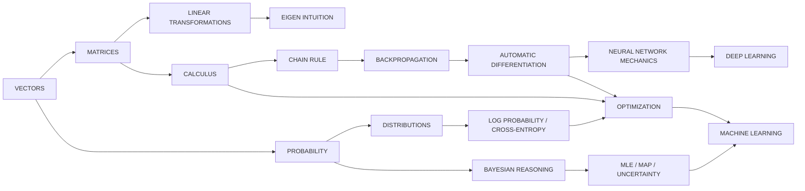
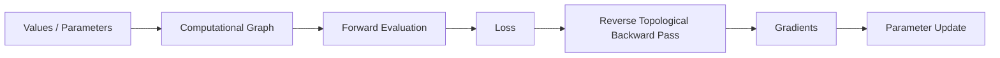

<div align="center">

# Math for AI

### Mathematics as executable intuition

**Linear algebra → calculus → autodiff → probability → Bayesian reasoning → optimization → learning systems**


**Days 13–21 · 9 foundation modules · 90+ session/practice artifacts**

[← AI Engineer Journey](../README.md) · [Full Roadmap](../ROADMAP.md) · [Current Optimization Lab](./day-21)

</div>

---

# Why this track exists

Machine learning is full of abstractions that are easy to use before they are understood:

- vectors become “embeddings”;
- matrix multiplication becomes “a layer”;
- derivatives become `.backward()`;
- probability becomes “model confidence”;
- cross-entropy becomes a loss-function name;
- optimization becomes `optimizer.step()`.

This track is my attempt to remove those black boxes one layer at a time.

The goal is **not** to become a mathematician for the sake of symbolic manipulation. The goal is to build enough mathematical intuition that model behavior can be reasoned about, debugged, and engineered deliberately.

The recurring question is:

> **What behavior does this piece of mathematics create inside a learning system?**

---

# The learning loop

Every serious concept is approached through the same sequence:

```text
WHAT IS IT?
    ↓
WHY DOES IT EXIST?
    ↓
INTUITION / GEOMETRY
    ↓
MATHEMATICAL FORM
    ↓
SMALL NUMERICAL EXAMPLE
    ↓
PYTHON IMPLEMENTATION
    ↓
EXPERIMENT / COMPARISON
    ↓
WHY IT MATTERS FOR AI
```

This is why the files in this track often contain both long-form notes and executable code. The notes are part of the implementation evidence, not decoration around it.

---

# Dependency map



The important point is that the modules are not isolated chapters. They form one chain toward training and understanding models.

---

# Curriculum map

| Day | Module | Core question | Evidence in the repo |
|---:|---|---|---|
| **13** | [Linear Algebra I](./day-13) | How do we represent direction, similarity, span, and basis? | vectors/matrices from scratch, cosine similarity, projection, rank, Gram–Schmidt |
| **14** | [Linear Algebra II](./day-14) | How do matrix operations turn representations into computation? | matrix operations, determinant/inverse, 2-layer neuron-network practice |
| **15** | [Linear Transformations](./day-15) | How does a matrix transform a space? | rotation, scaling, shearing, reflection, composition, determinant geometry, eigen intuition |
| **16** | [Calculus for Learning](./day-16) | How do we measure change and curvature in model objectives? | analytical/numerical derivatives, partials, chain rule, Hessian, optimizer bridge |
| **17** | [Backpropagation Bridge](./day-17) | How does local derivative information move through a computation? | second-order ideas, integrals, backpropagation |
| **18** | [Automatic Differentiation](./day-18) | How can a program build and traverse its own computation graph? | autodiff mechanics, operations, activations, MLP, XOR, gradient checking, PyTorch comparison |
| **19** | [Probability & Distributions](./day-19) | How do we represent uncertainty and turn scores into probabilistic learning objectives? | major distributions, expectation/variance, CLT, softmax, log-softmax, cross-entropy, sampling |
| **20** | [Bayesian Reasoning](./day-20) | How should belief change when new evidence arrives? | Bayes, base rates, sequential updating, Naive Bayes, MLE/MAP, Beta uncertainty, A/B testing |
| **21** | [Optimization & Learning Dynamics](./day-21) | Why do parameter updates succeed, fail, oscillate, or stall? | GD/SGD/momentum/Adam, schedules, landscapes, minima, Rosenbrock experiments |

---

# Day 13 — Linear Algebra I: representation, similarity & basis

[`Open day-13 →`](./day-13)

This module establishes the geometry used everywhere later in AI.

### Sessions / concepts

1. **Linear-algebra intuition** — why vectors and matrices are useful representations.
2. **Vectors** — magnitude, direction, vector operations, geometric meaning.
3. **Build a Vector class** — representing vector operations directly in Python.
4. **Matrices** — structured collections of transformations / relationships.
5. **Dot product & cosine similarity** — alignment and similarity between representations.
6. **Projection** — decomposing one direction onto another.
7. **Build a Matrix class** — matrix behavior without immediately depending on NumPy.
8. **Linear dependence** — when vectors add no new direction to a space.
9. **Basis & rank** — how much independent information a representation contains.
10. **Gram–Schmidt** — constructing orthogonal directions from dependent/non-orthogonal vectors.

### Why AI cares

```text
vector representation
    ↓
features / embeddings
    ↓
dot products + similarity
    ↓
attention, retrieval, nearest-neighbor reasoning
```

Linear algebra becomes the language that later models use to store, compare, and transform information.

---

# Day 14 — Linear Algebra II: matrix computation & the neural bridge

[`Open day-14 →`](./day-14)

Day 14 moves from “what is a matrix?” toward the type of computation that starts resembling a neural network.

### Main artifacts

- matrix addition, multiplication, transpose and related operations;
- determinant and inverse intuition;
- practice building a small **2-layer neuron-network computation** from matrix operations.

### Connection forward

A dense neural layer is fundamentally a transformation of the form:

```text
input vector
   ↓
weight matrix × input
   ↓
+ bias
   ↓
non-linearity
```

This day starts connecting linear algebra to model computation rather than keeping it as abstract matrix arithmetic.

---

# Day 15 — Linear transformations & eigen intuition

[`Open day-15 →`](./day-15)

The focus shifts from “a matrix is a table of numbers” to:

> **A matrix is an operation that changes a space.**

### Sessions / experiments

- matrix transformation intuition;
- rotation;
- scaling;
- shearing;
- reflection;
- composition of transformations;
- determinant as geometric area/volume scaling;
- eigenvalues and eigenvectors;
- practice problems;
- from-scratch vs NumPy implementations.

### Why AI cares

Transformations are everywhere:

- neural layers transform representations;
- PCA reasons about important directions in data;
- covariance structure is spectral;
- image transformations are linear-algebra operations;
- embeddings are repeatedly transformed across model layers.

Eigenvectors add another idea: some directions keep their orientation under a transformation and are only scaled. That becomes important later in dimensionality reduction, covariance analysis, stability, and optimization.

---

# Day 16 — Calculus for learning systems

[`Open day-16 →`](./day-16)

Linear algebra describes **what a model computes**. Calculus begins to describe **how to change the model so the computation improves**.

### Sessions

1. **Derivatives** — local rate of change and slope.
2. **Numerical vs analytical derivatives** — approximation versus exact symbolic rules.
3. **Partial derivatives** — changing one variable while holding others fixed.
4. **Chain rule** — how changes propagate through composed functions.
5. **Hessian matrix** — second-order curvature across multiple variables.
6. **Optimizer connection** — using gradient information to update parameters.

### Core bridge

```text
model parameters
      ↓
prediction
      ↓
loss
      ↓
derivative of loss wrt parameters
      ↓
parameter update
```

Without this bridge, training is just a library call. With it, training becomes understandable as controlled movement over an objective surface.

---

# Day 17 — Second-order ideas, integrals & backpropagation

[`Open day-17 →`](./day-17)

Day 17 connects calculus directly to neural-network learning.

### Main topics

- **second-order optimization** — why curvature can provide information beyond first derivatives;
- **integrals** — accumulation and the idea behind continuous probability / area under curves;
- **backpropagation** — repeated application of the chain rule across a computation graph.

### Backpropagation intuition

```text
forward pass:
inputs → operations → prediction → loss

backward pass:
loss → local derivatives → chain rule → parameter gradients
```

The important realization is that backpropagation is not a separate mysterious algorithm. It is an efficient organization of the chain rule.

---

# Day 18 — Automatic differentiation & neural mechanics from scratch

[`Open day-18 →`](./day-18)

This module turns backpropagation from mathematics into a small software system.

### Sessions / artifacts

- chain rule + autodiff notes;
- backward/topological traversal concept;
- operation-level gradient rules;
- activation functions;
- neuron, layer, and MLP construction;
- XOR training;
- numerical gradient checking;
- comparison with PyTorch behavior;
- a compact autodiff implementation from scratch.

### Engineering picture



This is the point where mathematics and software architecture meet: every operation must remember enough local information to participate correctly in the backward pass.

---

# Day 19 — Probability, distributions & probabilistic learning

[`Open day-19 →`](./day-19)

The next problem is uncertainty. Real data is noisy, incomplete, variable, and probabilistic.

### Sessions / concepts

1. probability fundamentals;
2. Bernoulli distribution;
3. categorical distribution;
4. Poisson distribution;
5. uniform distribution;
6. normal / Gaussian distribution;
7. expected value and variance;
8. joint and marginal distributions;
9. Central Limit Theorem;
10. log probability;
11. softmax;
12. log-softmax;
13. cross-entropy;
14. sampling from distributions.

### The AI chain

```text
raw model scores (logits)
        ↓
softmax
        ↓
probability distribution
        ↓
log probability
        ↓
cross-entropy / negative log-likelihood
        ↓
training objective
```

This day is therefore not merely “statistics.” It directly explains the probabilistic language used in classification and modern neural-network losses.

---

# Day 20 — Bayesian reasoning, estimation & uncertainty

[`Open day-20 →`](./day-20)

Probability describes uncertainty. Bayesian reasoning asks how that uncertainty should change when evidence arrives.

### Progression

1. Bayesian thinking;
2. conditional-probability reversal;
3. prior, likelihood, evidence, posterior;
4. Bayes derivation + total probability;
5. base rates through diagnostic-style examples;
6. sequential Bayesian updating;
7. Naive Bayes spam classification;
8. learning Naive Bayes probabilities from data;
9. Laplace smoothing;
10. log probabilities and numerical underflow;
11. maximum likelihood estimation (MLE);
12. maximum a posteriori estimation (MAP);
13. Beta distribution and uncertainty;
14. Bayesian updating with Beta priors/posteriors;
15. Bayesian A/B testing;
16. Beta updating in Python;
17. Bayesian A/B testing in Python;
18. MLE vs MAP vs posterior-mean comparison;
19. final lesson review / consolidation.

### Concept map

```text
PRIOR belief
    +
LIKELIHOOD of evidence
    ↓
POSTERIOR belief
    ↓
more evidence
    ↓
new posterior
```

### Estimation connection

- **MLE** asks: which parameter makes the observed data most likely?
- **MAP** asks: which parameter is most probable after combining prior + evidence?
- **Posterior mean** summarizes the full posterior distribution rather than choosing only its highest point.

This module builds the intuition needed later for uncertainty, probabilistic modeling, regularization interpretations, Bayesian ML, and evidence-aware decision making.

---

# Day 21 — Optimization & learning dynamics

[`Open day-21 →`](./day-21)

Optimization is where the previous layers meet:

- calculus supplies gradients;
- autodiff computes them efficiently;
- probability/loss functions define what “better” means;
- optimization decides how parameters move.

### Sessions / experiments

1. optimization fundamentals;
2. learning rate;
3. batch GD vs SGD vs mini-batch;
4. SGD with momentum;
5. Adam intuition and first/second moments;
6. Adam bias correction;
7. Adam from scratch;
8. learning-rate schedules;
9. convex vs non-convex optimization;
10. saddle points and plateaus;
11. loss landscapes;
12. sharp vs flat minima;
13. Rosenbrock function and its narrow curved valley;
14. Rosenbrock gradient;
15. vanilla gradient descent on Rosenbrock;
16. momentum on Rosenbrock;
17. GD vs Momentum vs Adam comparison;
18. optimization experiments and practice.

### Why Rosenbrock appears here

The Rosenbrock function is not an AI model. It is a deliberately difficult optimization landscape that makes optimizer behavior visible.

```text
simple quadratic
→ easy sanity check

Rosenbrock valley
→ curved + narrow
→ exposes oscillation / slow progress
→ makes momentum and adaptive methods easier to reason about
```

The goal of the module is to move from:

> “Adam usually works well”

into:

> “I can explain what gradient history, momentum, adaptive scaling, curvature, and learning rate are doing to the trajectory.”

---

# Coverage matrix

| Mathematical idea | Implemented / explored | Where it connects next |
|---|:---:|---|
| Vector operations | ✅ | features, embeddings, representation learning |
| Dot product / cosine similarity | ✅ | retrieval, attention intuition, similarity search |
| Matrix operations | ✅ | neural layers, transforms, data representation |
| Linear transformations | ✅ | representation change, networks, image geometry |
| Eigenvectors / eigenvalues | ✅ | PCA, covariance, spectral intuition |
| Derivatives / partials | ✅ | gradients and learning |
| Chain rule | ✅ | backpropagation |
| Hessian / curvature | ✅ | second-order and optimization intuition |
| Backpropagation | ✅ | neural-network training |
| Automatic differentiation | ✅ | PyTorch/JAX-style computation graphs |
| Probability distributions | ✅ | uncertainty, likelihoods, data modeling |
| Expectation / variance | ✅ | statistics, initialization, uncertainty |
| Joint / marginal probability | ✅ | probabilistic models |
| CLT / Gaussian intuition | ✅ | noise, sampling, statistical behavior |
| Softmax / log-softmax | ✅ | multi-class outputs |
| Cross-entropy | ✅ | classification objectives |
| Bayes theorem | ✅ | evidence-driven belief updates |
| MLE / MAP | ✅ | model fitting / probabilistic estimation |
| Beta uncertainty | ✅ | Bayesian updating, A/B testing |
| Gradient descent | ✅ | model training |
| Momentum / Adam | ✅ | deep-learning optimization |
| Loss landscapes | ✅ | non-convex training behavior |

---

# How to read the code

The `.py` files are intentionally not minimal tutorial scripts. Many are **executable notes** containing:

- theory in comments/docstrings;
- intuition;
- worked calculations;
- small Python experiments;
- output interpretation;
- AI/ML connections.

A useful way to inspect a day is:

```text
1. Read the first session for the question and intuition.
2. Run the numerical examples.
3. Modify the inputs / assumptions.
4. Compare later sessions that introduce more realistic behavior.
5. Read the final experiment as evidence for the module's main claim.
```

Run a file from the repository root, for example:

```bash
python math-for-ai/day-21/session17-Compare_GD_Momentum_and_Adam.py
```

---

# Standard for a completed math topic

A topic is strongest when it leaves several forms of evidence:

- [x] **Intuition** — explain what the object means without hiding behind notation.
- [x] **Mathematics** — show the equation or derivation that controls the behavior.
- [x] **Numerical example** — calculate at least one concrete case.
- [x] **Implementation** — express the mechanism in Python.
- [x] **Experiment** — vary a parameter, assumption, or algorithm.
- [x] **Interpretation** — explain what the output means.
- [x] **AI connection** — connect the idea to models, training, data, or inference.

The standard is not “I saw the formula.” It is **I can move between the formula, code, behavior, and engineering consequence.**

---

# What this foundation unlocks

```text
LINEAR ALGEBRA
  └─ representation, transformations, embeddings

CALCULUS + AUTODIFF
  └─ gradients, backpropagation, training

PROBABILITY + BAYES
  └─ uncertainty, likelihood, estimation, losses

OPTIMIZATION
  └─ parameter updates and learning dynamics

ALL FOUR TOGETHER
  └─ machine learning + deep learning with fewer black boxes
```

The next layers of the broader repository can now build on these foundations rather than introducing them for the first time inside a model implementation.

---

<div align="center">

### Mathematics is not a prerequisite to finish. It is a tool to keep using.

[← Main README](../README.md) · [Full Roadmap](../ROADMAP.md) · [Optimization Lab →](./day-21)

</div>
