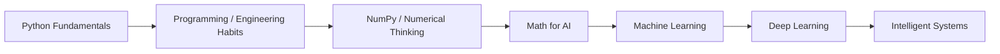

<div align="center">

# Python for AI

### Programming foundations before model abstractions

**Core Python → reusable program structure → numerical computing → AI implementation readiness**


**Days 01–12 · programming fundamentals + numerical bridge**

[← AI Engineer Journey](../README.md) · [Full Roadmap](../ROADMAP.md) · [Math for AI →](../math-for-ai/README.md)

</div>

---

# Why this track exists

AI code becomes difficult very quickly if basic programming decisions are still consuming all of the attention.

Before model architecture, optimization, distributed data, or LLM systems, I wanted Python to become a tool I could **reason with**, not just a syntax I could copy.

The purpose of this track is therefore broader than learning Python commands.

It is about building the habits required to:

- translate an idea into executable logic;
- decompose a problem into functions and objects;
- inspect state when something breaks;
- work with files, modules, packages, and environments;
- write reusable rather than one-off code;
- understand iteration and memory behavior;
- move naturally into numerical computing;
- eventually implement ML concepts without Python itself becoming the black box.

---

# Progression

```text
SYNTAX
  ↓
CONTROL FLOW
  ↓
FUNCTIONS + DATA STRUCTURES
  ↓
MODULES + ERRORS + FILES
  ↓
OBJECT-ORIENTED DESIGN
  ↓
ITERATION + GENERATORS
  ↓
FUNCTIONAL PATTERNS
  ↓
ENVIRONMENTS + DEPENDENCIES
  ↓
NUMERICAL PYTHON / NUMPY
  ↓
MATH + MACHINE LEARNING IMPLEMENTATION
```

This track feeds directly into [`math-for-ai`](../math-for-ai), where Python stops being the topic and becomes the language used to express mathematical and learning mechanisms.

---

# Capability map

| Area | What I worked on | Why it matters later |
|---|---|---|
| **Core language** | variables, types, operators, expressions, input/output | precise control over data and program state |
| **Control flow** | conditions, loops, branching | algorithm implementation |
| **Functions** | parameters, return values, scope, decomposition | reusable model/data logic |
| **Collections** | lists, tuples, sets, dictionaries | real data manipulation |
| **Modules & packages** | imports, reusable code organization | multi-file engineering |
| **Exceptions** | failure handling and debugging | robust pipelines/services |
| **File handling** | reading/writing persistent data | datasets, artifacts, configs |
| **OOP** | classes, inheritance, encapsulation, abstraction, polymorphism | model/components/system design |
| **Iterators / generators** | lazy iteration and custom iteration behavior | scalable data processing patterns |
| **Functional tools** | lambdas, comprehensions, `map`, `filter`, `reduce` | concise transformations and pipeline thinking |
| **Environment tooling** | `pip`, `requirements.txt`, virtual environments | reproducible execution |
| **NumPy** | arrays, functions, random module, numerical operations, linear-algebra bridge | vectorized ML/math computation |

---

# Foundation body — Days 01–10

[`Browse day-01 → day-10`](./day-01)

The early folders build the general programming foundation required before numerical AI work becomes the focus.

The emphasis is not on memorizing Python trivia. Each concept is treated as a tool for building larger programs.

### Core questions

- When should logic live in a function instead of inline code?
- What should a function receive and return?
- What belongs inside an object?
- How should state be represented?
- What happens when code fails?
- How do modules reduce duplication?
- Why are iterators and generators useful when data becomes large?
- What problem do virtual environments solve?

### Programming concepts covered across the foundation

```text
Variables / Types / Operators
        ↓
Conditions / Loops
        ↓
Functions / Scope
        ↓
Lists / Tuples / Sets / Dictionaries
        ↓
Modules / Packages
        ↓
Exceptions / Files
        ↓
Classes / OOP
        ↓
Iterators / Generators
        ↓
Functional patterns
        ↓
Environment + dependency management
```

---

# Days 11–12 — NumPy: the numerical bridge

Python's ordinary objects are excellent for general programming, but AI and scientific computing rely heavily on **dense numerical arrays and vectorized operations**.

This is where the Python track begins connecting directly to the mathematical track.

## Day 11 — NumPy fundamentals

[`Open day-11 →`](./day-11)

Current evidence includes:

- NumPy array fundamentals;
- array-oriented operations;
- practical NumPy exercises.

The important transition is from thinking:

```python
for every number:
    do one operation
```

into thinking:

```text
operate on the whole numerical structure
```

That mental shift becomes important for matrix operations, tensors, datasets, and model computation.

## Day 12 — Numerical operations & linear-algebra bridge

[`Open day-12 →`](./day-12)

The repository includes work around:

- NumPy functions;
- array-initialization functions;
- NumPy random utilities;
- additional array operations;
- matrix-operation practice;
- NumPy linear-algebra functions.

This day acts as the handoff into [`math-for-ai/day-13`](../math-for-ai/day-13), where vectors and matrices are explored more deeply from both mathematical and from-scratch perspectives.

---

# Why NumPy is not “just another library” here

NumPy changes the level at which Python code can express numerical problems.

```text
plain Python values
      ↓
NumPy arrays
      ↓
vectorized operations
      ↓
linear algebra / probability experiments
      ↓
feature matrices / tensors
      ↓
ML + DL computation
```

Understanding both sides matters:

- **plain Python** helps expose the algorithm;
- **NumPy** makes the same idea practical for numerical work.

That pattern continues later with higher-level AI frameworks: understand the mechanism first, then use the abstraction deliberately.

---

# Learning standard

A Python concept is not useful here only because the syntax runs.

A strong session should answer several layers:

| Layer | Question |
|---|---|
| **Syntax** | How is it written? |
| **Mechanism** | What is Python actually doing? |
| **Design** | Why would I choose this construct? |
| **Failure** | What commonly breaks or surprises me? |
| **Use case** | Where would this appear in real software? |
| **AI connection** | How does it help with data, models, experiments, or infrastructure? |

The objective is to make later AI code easier to inspect rather than easier to blindly copy.

---

# Engineering habits this track is building

### Decomposition

Turn a large task into smaller functions, modules, and objects with clear responsibilities.

### Debugging

Inspect the actual state of a program instead of guessing why it failed.

### Reusability

Prefer a function/class/module that can be tested and reused over duplicated notebook-style fragments.

### Reproducibility

Treat environments and dependencies as part of the program rather than something that only exists on one machine.

### Explicit data flow

Understand what data enters a function, how it changes, and what leaves it.

### From-scratch first when it teaches something

When a library would hide the exact mechanism I am trying to learn, implement a smaller version first.

---

# Connection to the rest of the AI journey



Python is the foundation layer, not the final destination.

Once the language and numerical tools are stable enough, the focus should move upward to mathematics, data, models, and systems — while Python remains the implementation medium underneath them.

---

# Repository navigation

```text
python-for-ai/
│
├── README.md          # Track overview
├── day-01 ... day-10  # Core programming foundation
├── day-11             # NumPy fundamentals
└── day-12             # NumPy functions + numerical / linear-algebra bridge
```

For the next layer:

→ [`Math for AI`](../math-for-ai/README.md)

For the complete long-term progression:

→ [`AI Engineering Roadmap`](../ROADMAP.md)

---

# Exit condition for this track

This phase is successful when I can focus on the **AI problem** instead of spending most of the effort fighting the programming language.

That means being able to:

- read and modify unfamiliar Python;
- implement formulas and algorithms;
- structure code into reusable pieces;
- use NumPy for numerical reasoning;
- debug execution failures;
- manage dependencies/environments;
- build the next layers without treating Python itself as magic.

---

<div align="center">

### Strong model code starts with strong general code.

[← Main README](../README.md) · [Roadmap](../ROADMAP.md) · [Math for AI →](../math-for-ai/README.md)

</div>
